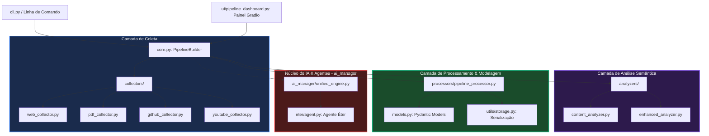

# 🛡️ CerBerus Pipeline Builder — Documentação Completa do Repositório

Esta é a documentação técnica oficial e detalhada do módulo **Pipeline Builder** do framework **CerBerusFMK**. Este documento foi projetado especificamente para servir como o manual de referência principal do repositório no **GitHub**, mapeando cada arquivo, fluxo arquitetural, limitações atuais e instruções de implantação.

---

## 🗺️ 1. Visão Geral da Arquitetura

O **Pipeline Builder** é o subsistema do CerBerusFMK responsável pela coleta inteligente, processamento, análise semântica e estruturação de dados vindos de fontes externas (Web, PDF, GitHub, YouTube) em pipelines otimizados para o treinamento e fine-tuning de modelos de linguagem (LLMs).

### Fluxo de Dados e Componentes



---

## 📂 2. Estrutura de Arquivos e Responsabilidades

Abaixo está o mapeamento detalhado de todos os arquivos contidos no diretório `/cerberus_api/pipeline_builder/` e suas respectivas responsabilidades técnicas:

### 🗄️ Arquivos Raiz
| Arquivo | Descrição / Responsabilidade Técnica | Status no Repositório |
| :--- | :--- | :--- |
| `__init__.py` | Ponto de entrada do pacote. Define a exposição das classes principais (ex: `PipelineBuilder`). | 🔴 **Crítico**: Importa implicitamente o `ai_manager`, gerando crash de GLIBC se a biblioteca `llama_cpp` estiver desalinhada. |
| `core.py` | A classe central `PipelineBuilder`. Orquestra a coleta assíncrona, a análise de relevância semântica e a chamada para o processador de pipelines. | ⚠️ **Atenção**: Possui algumas funções legadas que operam com dicionários brutos em vez de Pydantic. |
| `models.py` | Define as estruturas de dados usando **Pydantic v2** (`DataSource`, `ContentChunk`, `Pipeline`, `AnalysisResult`). | 🔴 **Bug**: O modelo `Pipeline` carece de campos instanciados pelo processador (ex: `sources`, `size_bytes`, `estimated_tokens`). |
| `cli.py` | Interface de linha de comando baseada em `argparse`. Permite criar, listar, detalhar e aprovar pipelines, além de rodar o dashboard. | ✅ Funcional para comandos básicos. |
| `setup.py` | Script de empacotamento padrão do Python (`setuptools`) para instalação do pacote. | ✅ Pronto para distribuição. |
| `requirements.txt` | Lista de dependências Python. Declara bibliotecas como Pydantic, Trafilatura, Justext, PyMuPDF, Gradio, etc. | ⚠️ **Atenção**: Especifica `pydantic<2.0.0`, mas o ambiente utiliza `v2.12.3`. |
| `CHANGELOG.md` | Registro histórico das modificações, correções e novas features das versões do builder. | ✅ Atualizado. |
| `README.md` | Guia de introdução rápida do repositório contendo exemplos rápidos de uso. | ✅ Documentação do usuário. |

---

### 🌐 Camada de Coletores (`collectors/`)
Coletores especializados em extrair texto limpo de múltiplos formatos:

*   **`__init__.py`**: Inicialização do módulo de coletores.
*   **`web_collector.py`** (✅ *Funcional*): Coleta páginas web usando `trafilatura` e `justext` para remover boilerplate (menus, rodapés, anúncios) e focar apenas no conteúdo textual útil.
*   **`pdf_collector.py`** (✅ *Funcional*): Extrai texto de PDFs locais e remotos utilizando três fallbacks de bibliotecas (`PyMuPDF`, `pdfminer.four`, `PyPDF2`) para máxima resiliência de leitura.
*   **`github_collector.py`** (⚠️ *Funcional mas não integrado*): Clona repositórios Git localmente usando `GitPython` e extrai código-fonte filtrando por extensão de arquivo.
*   **`youtube_collector.py`** (⚠️ *Mocado*): Coleta transcrições de vídeos. Se o pacote `youtube_transcript_api` não estiver disponível ou faltar credenciais, retorna dados estruturados de simulação (mock).

---

### 🔬 Camada de Análise (`analyzers/`)
Avalia a qualidade dos chunks extraídos e calcula métricas de relevância:

*   **`__init__.py`**: Exposição das classes de análise.
*   **`content_analyzer.py`** (✅ *Funcional*): Avaliação clássica baseada em frequência de palavras (TF-IDF), contagem de palavras-chave, parada de palavras (stop words) usando `nltk` e heurísticas de legibilidade.
*   **`enhanced_analyzer.py`** (🔴 *Quebrado*): Analisador semântico avançado que usa `sentence-transformers` para embeddings e cálculo de similaridade por cosseno. Atualmente falha porque importa diretamente o agente `eter` no nível de módulo.

---

### ⚙️ Camada de Processamento (`processors/`)
Responsável por estruturar a informação e criar o pipeline final:

*   **`__init__.py`**: Exposição do processador de pipeline.
*   **`pipeline_processor.py`** (🔴 *Quebrado*): Filtra chunks com base no score de relevância, estima contagem de tokens semânticos, calcula o tamanho do dataset gerado e serializa o resultado em disco no formato `Pipeline`. Sofre exceção de validação devido a campos extras não definidos no modelo Pydantic.

---

### 🛠️ Camada de Utilitários (`utils/`)
Mecanismos auxiliares de otimização e processamento matemático:

*   **`__init__.py`**: Exposição de utilitários gerais.
*   **`storage.py`** (✅ *Funcional*): Utilitários para persistência de dados JSON.
*   **`nlp_utils.py`** (✅ *Funcional*): Limpeza de texto, tokenização leve e download/gerenciamento de modelos do `spaCy`.
*   **`memory_manager.py`** (✅ *Funcional*): Utilitário de perfilamento de memória e coleta de lixo preventiva para tarefas pesadas.
*   **`optimizer.py`** (⚠️ *Órfão*): Otimizadores de CUDA/PyTorch para processamento em GPU.
*   **`flash_attention.py`, `sparse_attention.py`, `rotary_embeddings.py`, `dynamic_quantization.py`, `jax_config.py`, `triton_config.py`** (⚠️ *Órfãos*): Implementações matemáticas e configurações de kernel de baixíssimo nível para aceleração de hardware. Não são consumidos no fluxo principal do Pipeline Builder.

---

### 🖥️ Interface Gráfica (`ui/`)
Interface de usuário local:

*   **`__init__.py`**: Exposição do dashboard.
*   **`pipeline_dashboard.py`** (🔴 *Quebrado*): Painel interativo construído em `Gradio`. Apresenta abas de visualização, criação de pipelines, gráficos de t-SNE das embeddings e grafos de relacionamento semântico. Quebra porque chama métodos que não existem na classe `PipelineBuilder` do `core.py`.

---

### 🧠 Subsistema de IA (`ai_manager/`)
Uma engine completa de inferência local que abriga o agente cognitivo **Éter**:

*   **`__init__.py`** (🔴 *Quebrado*): Ponto de entrada do subsistema. Força a importação de `llama_cpp`, gerando erro crítico de versão da biblioteca GLIBC.
*   **`unified_engine.py`** (🔴 *Quebrado*): Interface de inferência unificada. Tenta importar módulos de aceleração CUDA inexistentes.
*   **`model_hub.py`** (⚠️ *Atenção*): Gerenciador de download de modelos locais (GGUF). Apresenta falhas de importação de submódulos de tokens.
*   **`agent.py`** (⚠️ *Órfão*): Classe alternativa para agentes de inferência baseada em HuggingFace transformers.
*   **`eter/`** (🔴 *Submódulo Quebrado*):
    *   `agent.py`: Implementa o agente cognitivo autônomo `EterAgent` com memória vetorial e loop de raciocínio. Contém erros em nomes de atributos privados (ex: `self._logger` em vez de `self.logger`).
    *   `core_integration.py`: Ponte que executa subprocessos locais no terminal Linux (⚠️ **Falha de Segurança**: Command Injection via concatenação de string).
    *   `cuda_accelerator.py`: Configurações de execução paralela em GPU.
    *   `gguf_loader.py` & `llama_cpp_loader.py`: Carregadores de modelos quantizados. Quebram devido à biblioteca do compilador `llama-cpp-python`.
    *   `tools/` (`shell.py`, `files.py`): Utilitários do agente para manipular arquivos e rodar shell scripts.
    *   `security/access_control.py`: Verificações simples de permissão.

---

## 🩺 3. Diagnóstico e Integridade do Repositório

Se você estiver publicando este repositório para o GitHub, é crucial estar ciente das inconsistências atuais que devem ser corrigidas nas próximas releases:

### ⚠️ Bugs de Alta Severidade Detectados
1.  **Incompatibilidade GLIBC (`llama_cpp`)**: O binário compilado de `llama-cpp-python` requer `GLIBC_2.38` ou superior. Em ambientes com `GLIBC_2.35` (como Ubuntu 22.04 LTS), qualquer comando do Python que importe `cerberus_api` falha instantaneamente.
2.  **Mismatch no Pydantic**: O processador tenta construir a instância de `Pipeline` passando atributos que não existem na definição do modelo em `models.py`. Como o Pydantic v2 é estrito, isso levanta uma exceção de runtime.
3.  **Métodos Fantasmas no Dashboard**: O painel Gradio (`pipeline_dashboard.py`) tenta chamar as funções `process_pipeline`, `get_pipeline_chunks` e `get_pipeline_sources` no `PipelineBuilder`, que não estão declaradas no `core.py`.
4.  **Código Morto / Órfão**: Cerca de **47%** dos arquivos Python contidos neste diretório (incluindo otimizadores CUDA de baixo nível e loaders adicionais do Éter) não são importados por nenhuma parte ativa do sistema.

---

## 🚀 4. Como Executar o Projeto

Para testar o fluxo de coleta e análise funcional (que não depende de IA local):

### 1. Preparar o Ambiente Virtual
```bash
python3 -m venv venv
source venv/bin/activate
pip install -r requirements.txt
```

### 2. Instalar Modelos de Linguagem do spaCy
```bash
python -m spacy download pt_core_news_sm
python -m spacy download en_core_web_sm
```

### 3. Executar o Pipeline Web (Exemplo Simples)
```bash
python -m examples.simple_pipeline
```

### 4. Executar os Testes Unitários
```bash
python -m unittest discover -s tests
```

---

## 🐙 5. Guia para Publicação no GitHub (Para o Desenvolvedor)

Como o repositório remoto está configurado como `git@github.com:Ezequiel-CEO/CerBerus_Pipeline_Builder.git`, siga os passos abaixo para sincronizar seus commits locais:

### Passo 1: Verificar Alterações Locais
```bash
git status
```

### Passo 2: Adicionar Alterações ao Index (Se houver)
```bash
git add .
git commit -m "docs: adiciona documentação técnica detalhada dos arquivos do repositório"
```

### Passo 3: Configurar a Branch Principal
Garanta que você está na branch correta (normalmente `main` ou `master`):
```bash
git branch -M master
```

### Passo 4: Realizar o Push
Como sua chave SSH já foi validada com sucesso pelo GitHub, realize o envio com:
```bash
git push -u origin master
```

> [!NOTE]
> Se o repositório remoto ainda não tiver sido criado no seu painel do GitHub sob a conta **Ezequiel-CEO**, acesse [github.com/new](https://github.com/new) e crie um repositório chamado `CerBerus_Pipeline_Builder` antes de executar o comando `git push`.
